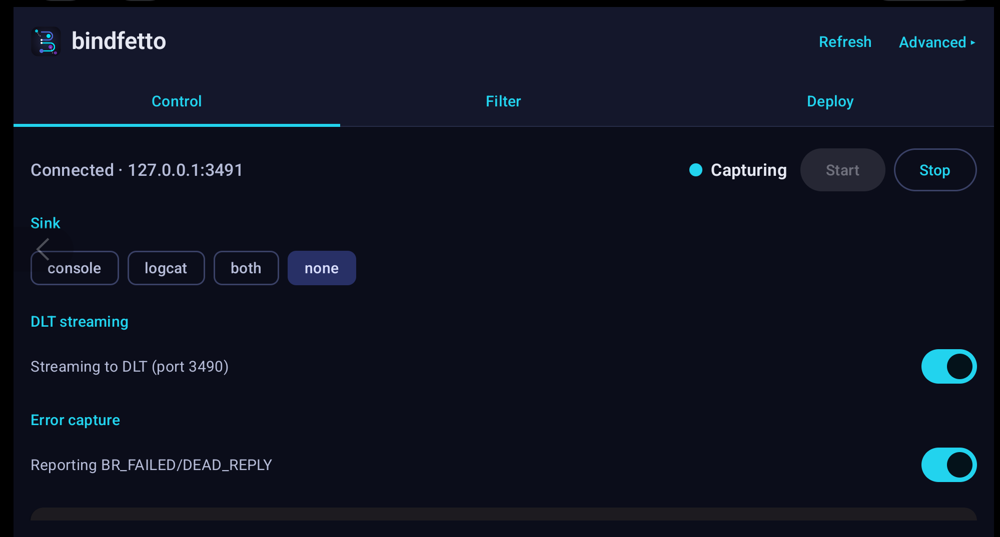

# BINDFETTO


## Live kernel-level Binder IPC tracing for Android

Bindfetto observes Android **Binder** IPC traffic at the kernel level and surfaces it
as human-readable transaction logs.

> **The highlight: offline method-name decoding.** The kernel hot path stays cheap by
> emitting only the *raw* transaction code. A separate offline pass — in the CLI, DLT
> Viewer, or VS Code — resolves that code to the real method name against a precompiled
> **AIDL catalog**.

Example of capture on real hardware target in DLT-Viewer:
```
... BFTO BFTO BIND 0 log info verbose 1 BINDFETTO dded.projection (41933) -> pid:33480 (33480):
android.content.pm.IPackageManager.getApplicationInfo(packageName="com.google.android.embedded.projection", flags=128, userId=0), 184B
```

The bundled Android **control app** drives the on-device daemon live — toggle capture,
switch sinks, stream to DLT, and pick which interfaces to keep:



No Perfetto or tracing stack — just a standalone binary. Ideal for **automotive
development and in-car testing.**

---

## Architecture

Bindfetto is deliberately split into a **fast on-device capture path** and a **rich
offline decode path**. The device only records the *raw* transaction code; method
names are resolved later against an AIDL catalog. This keeps the kernel hot path cheap
and lets the same captured logs be re-decoded against any catalog version.

```
  ON DEVICE (root)                                OFFLINE (workstation / log viewer)
  +------------------------------------------+    +---------------------------------------+
  |  eBPF probe                              |    |  AIDL catalog                         |
  |    (binder_transaction / binder_return)  |    |    interface -> code -> method        |
  |        |                                 |    |        ^                              |
  |        v                                 |    |        | built from .aidl by          |
  |  ring buffer                             |    |        | catalog/ (Python)            |
  |        |                                 |    |                                       |
  |        v  resolve pid->name, raw code    |    |  decode core (Rust)                   |
  |  consumer                                |    |    resolves raw code -> method name   |
  |        |                                 |    |    CLI . DLT plugin . VS Code ext     |
  |        v                                 |    +---------------------------------------+
  |  sinks: console | logcat | JSONL | DLT   |                    ^
  +------------------------------------------+                    |
        ^                    |                                    |
        |                    +-- logs (raw code) ----------------+
        | control channel (TCP 3491)
  control app (Android, Kotlin/Compose)
```

### Components

| Component | Path | Language | Role |
|---|---|---|---|
| **Runtime** | `runtime/` | Rust (eBPF + userspace) | On-device capture. eBPF probe pushes a compact record per transaction through a ring buffer; the userspace consumer drains it, resolves process names, and writes to a sink. Emits the *raw* transaction code. |
| **Decode core** | `decode/` | Rust | Resolves raw codes to method names against a catalog. One library, three ABIs: a CLI, a C ABI, and WASM. |
| **Catalog builder** | `catalog/` | Python 3 | Turns AIDL source into the `interface → { code → method }` JSON catalog. |
| **DLT Viewer plugin** | `plugins/dlt/` | C++/Qt | Rewrites codes to method names inline in [DLT Viewer](https://github.com/COVESA/dlt-viewer). |
| **VS Code extension** | `plugins/vscode/` | TypeScript + WASM | Decodes a bindfetto log inside the editor. |
| **Control app** | `bindfetto-app/` | Kotlin / Jetpack Compose | Android GUI that drives the runtime daemon live over TCP. |

### How capture works

1. An **eBPF probe** attaches to the kernel's `binder:binder_transaction` tracepoint
   (and `binder:binder_return` for errors). For each transaction it emits a compact
   record — source/target pid, transaction code, flags, parcel size, and the
   interface-descriptor token read from the parcel.
2. Filtering happens **in the kernel** for cheapness: a BPF map holds the wanted
   interface descriptors (exact match), and flag maps toggle filtering / error capture
   live. Unwanted transactions are dropped *before* the ring buffer.
3. The **userspace consumer** resolves `pid → process name` from `/proc/<pid>/cmdline`
   (cached) and writes each record to the configured sink(s).
4. **Method names are never resolved on device.** The `[code:N]` token is resolved
   offline against an AIDL catalog. Special interface-agnostic transactions
   (`PING`/`DUMP`/`INTERFACE`/`SYSPROPS`/`SHELL_CMD`) resolve without a catalog.
5. **Parcel payloads, on demand.** With `--parcel` (under an interface filter) the probe
   also captures the raw parcel bytes; the offline decoder unmarshals them into method
   **arguments** — `acquireWakeLock(lock=<binder>, flags=1, tag="scr")` — against a v2
   catalog. Off by default and capped, so the hot path stays cheap. See below.

### Output sinks

| Sink | Flag | Notes |
|---|---|---|
| Console | `--sink console` (default) | Wall-clock timestamped lines. |
| Logcat | `--sink logcat` | Tag `bindfetto`, carries the `BINDFETTO` marker. |
| JSONL file | `--jsonl <path>` | One JSON object per transaction; composes with any sink. |
| DLT | `--dlt-serve [port]` | Bindfetto *is* the DLT TCP endpoint (default port 3490); DLT Viewer connects as a TCP ECU. No libdlt / dlt-daemon needed. |

---

## Requirements

- **Device:** an Android target with a BTF-enabled kernel (5.10+), **root**, and a
  permissive-capable SELinux domain. An **arm64 AVD** works well (runs natively on
  Apple silicon).
- **Runtime build:** Rust **nightly** (pinned via `rust-toolchain.toml`) + `rust-src`,
  `bpf-linker`, the `aarch64-linux-android` target, and the **Android NDK** (r26 or
  newer) for the cross-linker. The version in the paths below (`27.0.12077973`) is just
  an example — use whatever NDK you have installed under `ndk/<version>/`. (The `30` in
  the linker name is the target **Android API level** (minSdk 30), not the NDK version.)
- **adb** + the Android emulator/platform tools.
- **Decode / catalog / plugins:** a host toolchain per component (Rust, Python 3,
  Node, or Qt+CMake) — see below.

---

## Deploy the runtime (on device)

The core workflow is identical on every OS; only the **NDK toolchain path** and the
**linker wrapper name** differ. The cross-linker is configured in
`runtime/.cargo/config.toml` (defaults to `aarch64-linux-android30-clang` on PATH).

### 1. One-time toolchain setup

```sh
# All platforms
rustup toolchain install nightly
rustup component add rust-src --toolchain nightly
rustup target add aarch64-linux-android
cargo install bpf-linker
```

Then put the NDK's LLVM `bin` directory on PATH so the linker wrapper resolves. The
prebuilt directory name is host-specific:

**Linux**
```bash
export ANDROID_NDK_HOME="$HOME/Android/Sdk/ndk/27.0.12077973"
export PATH="$ANDROID_NDK_HOME/toolchains/llvm/prebuilt/linux-x86_64/bin:$PATH"
```

**macOS** (the prebuilt dir is named `darwin-x86_64` even on Apple silicon)
```bash
export ANDROID_NDK_HOME="$HOME/Library/Android/sdk/ndk/27.0.12077973"
export PATH="$ANDROID_NDK_HOME/toolchains/llvm/prebuilt/darwin-x86_64/bin:$PATH"
```

**Windows (PowerShell)** — the wrappers are `.cmd` files, so also point Cargo at the
`.cmd` linker:
```powershell
$env:ANDROID_NDK_HOME = "$env:LOCALAPPDATA\Android\Sdk\ndk\27.0.12077973"
$env:Path = "$env:ANDROID_NDK_HOME\toolchains\llvm\prebuilt\windows-x86_64\bin;$env:Path"
$env:CARGO_TARGET_AARCH64_LINUX_ANDROID_LINKER = "aarch64-linux-android30-clang.cmd"
```

### 2. Build, push, run (all platforms)

```sh
cd runtime
cargo build --release --target aarch64-linux-android   # embeds the eBPF object via build.rs

adb root
adb shell setenforce 0        # BPF load is SELinux-gated; permissive for dev

adb push target/aarch64-linux-android/release/bindfetto /data/local/tmp/
adb shell /data/local/tmp/bindfetto        # run as root
```

> On a new device, confirm the tracepoint field offsets in
> `bindfetto-ebpf/src/main.rs` (`OFF_TO_PROC`, `OFF_CODE`, `OFF_FLAGS`) match:
> ```sh
> adb shell cat /sys/kernel/tracing/events/binder/binder_transaction/format
> ```

### Common runtime invocations

```sh
# Keep only PowerManager + ActivityManager, stream to DLT Viewer, no console noise
adb shell /data/local/tmp/bindfetto --sink none --dlt-serve \
  --iface android.os.IPowerManager,android.app.IActivityManager

# Capture to JSONL and logcat, with error events on
adb shell /data/local/tmp/bindfetto --sink logcat --jsonl /data/local/tmp/tx.jsonl --errors on

# Run as a controllable daemon for the app (auto-binds the DLT server)
adb shell /data/local/tmp/bindfetto --control 3491 --sink none

# Capture parcel payloads (arguments) for one interface, up to 4 KiB each
adb shell /data/local/tmp/bindfetto --iface android.os.IPowerManager --parcel on --parcel-max 4096
```

| Flag | Effect |
|---|---|
| `--sink console\|logcat\|both\|none` | Human-readable line sink (default `console`). |
| `--jsonl <path>` | Also write one JSON object per transaction. |
| `--dlt-serve [port]` | Act as a DLT TCP server (default 3490). |
| `--iface <name>` | In-kernel exact-match interface filter; repeatable / comma-separated. |
| `--errors [on\|off]` | Capture `BR_FAILED_REPLY` / `BR_DEAD_REPLY` with a decoded errno. |
| `--parcel [on\|off]` | Capture raw parcel payloads (needs `--iface`); arguments decoded offline. |
| `--parcel-max <bytes>` | Cap on captured payload per transaction (default 256, max 30720). |
| `--include-replies` | Keep normal replies (otherwise dropped before the ring buffer). |
| `--control [port]` | Line-protocol TCP control channel (default 3491). |

---

## Build the offline decode toolchain

### Catalog builder (Python 3, stdlib only)

Works identically on Linux / macOS / Windows.

```sh
cd catalog
# a folder of AIDL (recursed), a single file, or an http(s) URL — mix freely
python3 bindfetto_catalog.py -o catalog.json /path/to/aosp/frameworks/base
python3 bindfetto_catalog.py https://android.googlesource.com/.../IPowerManager.aidl
# add --args for a v2 catalog with argument types (needed to decode --parcel payloads)
python3 bindfetto_catalog.py --args -o catalog.json /path/to/aosp/frameworks/base
```
> On Windows use `py bindfetto_catalog.py ...` if `python3` isn't on PATH.
> **Codes are aligned to the exact AIDL you feed it** — use the AIDL that matches the
> device build.

### Decode CLI (Rust, host build)

```sh
cd decode
cargo build --release        # also produces libbindfetto_decode.a + the C header

# decode a live logcat stream or a captured file
adb logcat -s bindfetto | ./target/release/bindfetto-decode --catalog catalog.json
./target/release/bindfetto-decode --catalog catalog.json capture.log
```
> With a v2 catalog (`--args`), lines that carry a captured `parcel=<hex>` token
> (runtime `--parcel`) render the method arguments — `acquireWakeLock(flags=1, tag="scr")` —
> marking `…(truncated)` past the cap and `<Type>, …(unparsed)` for binders/arrays/parcelables.
> On Windows the binary is `bindfetto-decode.exe`; pipe with PowerShell:
> `adb logcat -s bindfetto | .\target\release\bindfetto-decode.exe --catalog catalog.json`.

### VS Code extension (WASM)

```sh
cd plugins/vscode
rustup target add wasm32-unknown-unknown
npm install
npm run build:wasm    # cargo build (wasm32) → media/*.wasm
npm run compile       # tsc → dist/
npm run smoke         # standalone Node check, no VS Code needed
```
Set `bindfetto.catalogPath` to a catalog JSON (or a folder of them), open a bindfetto
log, and run **Bindfetto: Decode Active Editor**. Same steps on all three OSes.

### DLT Viewer plugin (C++/Qt)

Native Qt shared library — it must be built against the **same Qt major version and
compiler ABI as your dlt-viewer**, and needs the dlt-viewer `qdlt` SDK. Build the Rust
core first.

`/path/to/dlt-viewer` below is a checkout of
[COVESA/dlt-viewer](https://github.com/COVESA/dlt-viewer) built from source: the `qdlt`
headers live in its `qdlt/` source dir and `libqdlt.{so,dylib}` under its `build/`
output. (Alternatively, drop `plugins/dlt/` into the dlt-viewer source tree under
`plugin/` and let its build resolve the headers/lib for you.)

```sh
cd decode && cargo build --release        # produces libbindfetto_decode.a
cd ../plugins/dlt
cmake -B build -DDLT_VIEWER_DIR=/path/to/dlt-viewer   # a dlt-viewer checkout
cmake --build build
```

Then load the built plugin in DLT Viewer and set its config to your `catalog.json`:

| OS | Built artifact |
|---|---|
| Linux | `libbindfettodecoderplugin.so` |
| macOS | `libbindfettodecoderplugin.dylib` (Rust runtime pulls in CoreFoundation/Security, handled by CMake) |
| Windows | `bindfettodecoderplugin.dll` |

DLT Viewer has no fixed system plugins folder — it scans a **plugin search path you
configure** in the app: *Settings → Preferences → Plugins*, add the directory holding the
built artifact (e.g. `plugins/dlt/build/`), then enable **Bindfetto DLT decoder** in the
Plugin Manager and point its config at `catalog.json`. (The default search path, if any,
is shown in that same Preferences dialog.)

To get bindfetto lines into DLT Viewer where the OEM has no logcat→DLT bridge, run the
runtime with `--dlt-serve`, forward the port, and add a TCP ECU:

```sh
adb forward tcp:3490 tcp:3490   # then add a TCP ECU at localhost:3490 in DLT Viewer
```

---

## Deploy the control app (Android)

Needs **JDK 17+** (Android Studio's bundled JBR works) and the Android SDK. Building
the runtime first bundles its binary into the app for the Deploy tab; otherwise the
Deploy tab shows an adb fallback.

**Linux / macOS**
```bash
export JAVA_HOME="/path/to/jdk17"           # e.g. /Applications/Android Studio.app/Contents/jbr/Contents/Home on macOS
cd bindfetto-app
./gradlew :app:assembleDebug
adb install -r app/build/outputs/apk/debug/app-debug.apk
```

**Windows (PowerShell)**
```powershell
$env:JAVA_HOME = "C:\Program Files\Android\Android Studio\jbr"
cd bindfetto-app
.\gradlew.bat :app:assembleDebug
adb install -r app\build\outputs\apk\debug\app-debug.apk
```

Launch **bindfetto control** and tap **Connect**. The app runs on-device and reaches
the daemon at `127.0.0.1:3491`; from a host you can drive the same protocol via
`adb forward tcp:3491 tcp:3491` and any TCP client.

---

## Documentation

- `SPEC.md` — full design specification.
- `ROADMAP.md` — milestone-by-milestone build status.
- Per-component READMEs under `runtime/`, `decode/`, `catalog/`, `plugins/*`, `bindfetto-app/`.

## License

Apache-2.0. See [LICENSE](./LICENSE).
